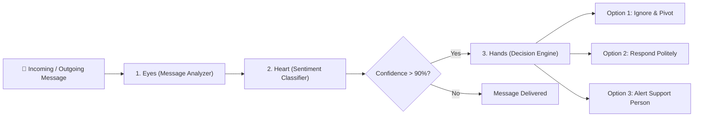

# Navi 🛡️ — Kids Online Safety Buddy

> **Empowering children with real-time AI coaching to navigate hostile digital environments safely, confidently, and independently.**

Navi is a privacy-first mobile application designed to protect children from cyberbullying and digital privacy risks. Rather than relying on constant surveillance or intrusive data tracking, Navi acts as an active digital citizenship buddy—intercepting harmful language and privacy risks in real time and equipping kids with constructive response strategies.

---

## 🌟 Key Features

* **3-Stage AI Intervention Pipeline:** Detects cyberbullying and privacy risks before messages are sent or read, offering children three constructive choices (*Ignore & Pivot*, *Respond Politely*, or *Alert Support Person*).
* **Privacy Guardian:** Automatically flags requests or disclosures of sensitive Personal Identifiable Information (PII), such as home addresses, phone numbers, school names, and parental presence.
* **Support Center & Counselor Bridge:** Allows kids to reach out for guidance from **Navi (AI)** or connect directly with a **Support Person 🤝**.
* **Parental Insights Dashboard:** Gives parents high-level metrics (Safety Index, Coaching Receptiveness, and intervention trends) without compromising child trust or reading raw private chat logs.
* **Role-Based Accounts & Age Verification:** Built-in workflows for **Child**, **Parent**, and **Support Person** accounts, featuring 18+ age verification for adult registration.
* **On-Device & Local LLM Integration:** Powered by an on-device/local `Gemma 2B` model via Ollama for dynamic, context-aware polite reply suggestions and empathetic child coaching.
* **Real-Time Database Sync:** Powered by Supabase for real-time chat updates and profile management.

---

## 🔬 Machine Learning Datasets & AI Architecture

Navi's safety engine utilizes a hybrid approach combining a high-speed Naive Bayes classifier with a local Large Language Model (`Gemma 2B`).

### 📊 Training Datasets & Data Points

| Dataset Name | Primary Purpose | Scale & Data Points |
| :--- | :--- | :--- |
| **Kaggle Cyberbullying Classification Dataset** | Multi-class harassment detection (Age harassment, Gender bullying, Insults, General cyberbullying) | **47,000+** annotated text instances |
| **AI4Privacy PII Dataset** | Privacy risk detection for addresses, phone numbers, school names, location tracking, & parental absence | **100,000+** synthetic PII patterns |
| **Kaggle Clean Kid-Speech Corpus** | Control dataset of safe, positive child interactions to minimize false positives | **15,000+** safe conversation samples |

### ⚙️ The 3-Stage Pipeline Engine



1. **Stage 1 — "Eyes" (Message Analyzer):** Uses Natural Language Processing (NLP) to tokenize input text, strip pronouns and common stopwords, assign numerical token IDs, and check against PII patterns.
2. **Stage 2 — "Heart" (Sentiment Classifier):** A Naive Bayes classifier trained with Laplacian smoothing ($\alpha = 0.1$) calculates normalized confidence probability scores across harassment and privacy risk categories.
3. **Stage 3 — "Hands" (Decision Engine):** If a toxicity score exceeds the 90% threshold, Navi triggers an interactive intervention overlay presenting three kind choices, ensuring the child always retains final agency.

---

## 🛠️ Technology Stack

* **Frontend Framework:** React Native / Expo (SDK 54), React Native Web
* **Local Machine Learning:** Custom Naive Bayes NLP Classifier + `Gemma 2B` via Ollama
* **Backend & Real-Time Sync:** Supabase (Postgres & Realtime WebSockets)
* **Storage:** `@react-native-async-storage/async-storage`

---

## 🚀 Getting Started

### Prerequisites

* [Node.js](https://nodejs.org/) (v18 or higher)
* [npm](https://www.npmjs.com/) or [yarn](https://yarnpkg.com/)
* [Expo Go](https://expo.dev/go) app on iOS or Android (for mobile testing)
* [Ollama](https://ollama.ai/) (optional, for local `gemma:2b` LLM features)

### Installation

1. **Clone the repository:**
   ```bash
   git clone https://github.com/adya-chauhan/kids-online-safety-buddy.git
   cd kids-online-safety-buddy
   ```

2. **Install dependencies:**
   ```bash
   npm install
   ```

3. **Configure Environment Variables (Optional for Supabase sync):**
   Create a `.env` file in the project root:
   ```env
   EXPO_PUBLIC_SUPABASE_URL=https://your-project.supabase.co
   EXPO_PUBLIC_SUPABASE_ANON_KEY=your-anon-key-here
   ```

4. **Start the application:**
   * **Web Mode:**
     ```bash
     npm run web
     ```
   * **Expo Go (Tunnel Mode for Mobile):**
     ```bash
     npx expo start --tunnel
     ```

---

## 📄 License

This project is licensed under the MIT License - see the [LICENSE](LICENSE) file for details.
